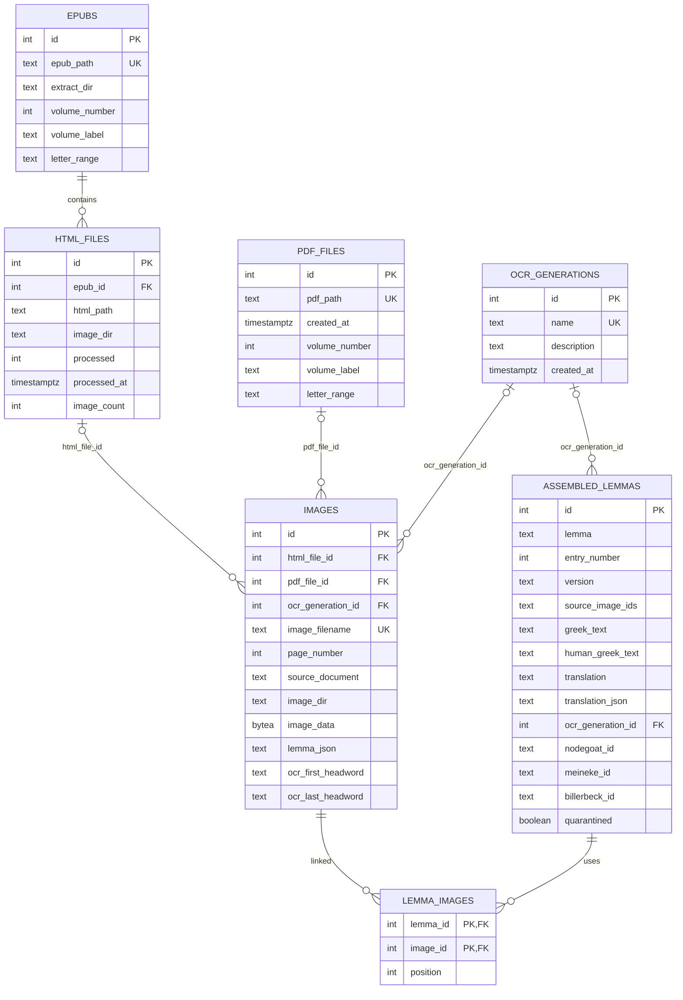
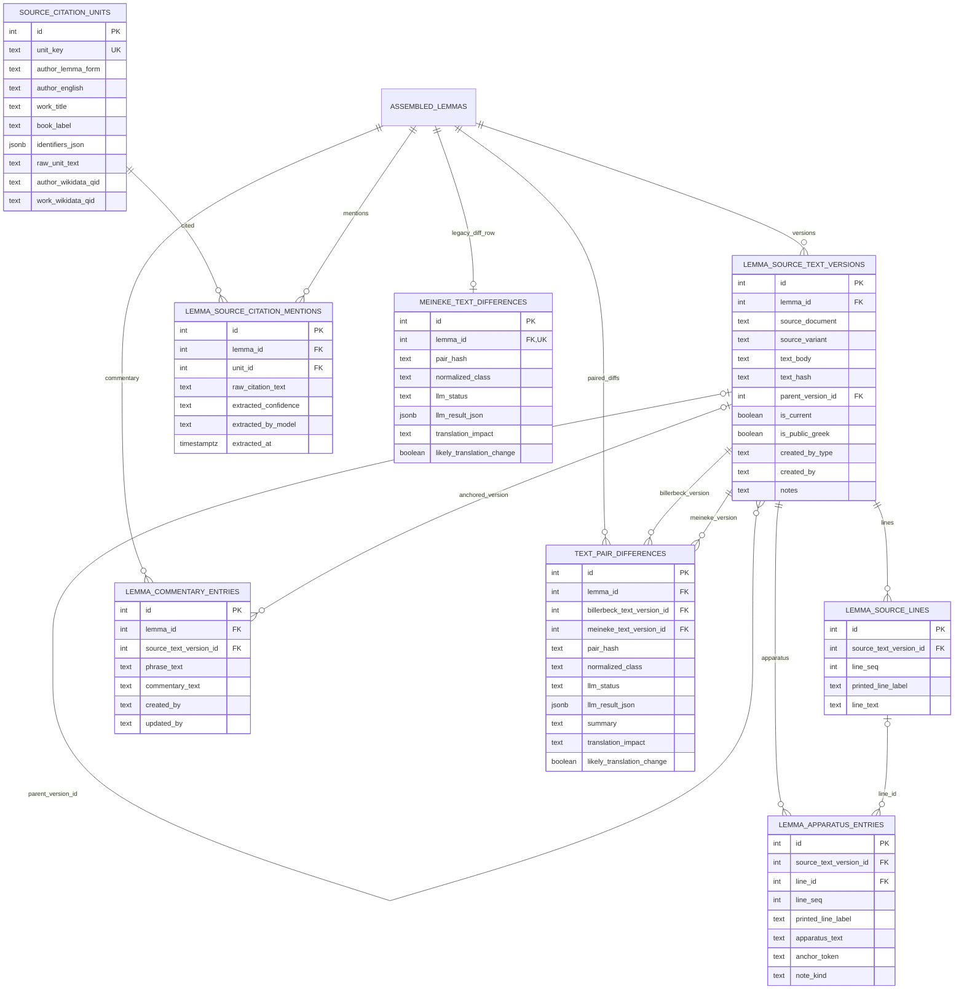
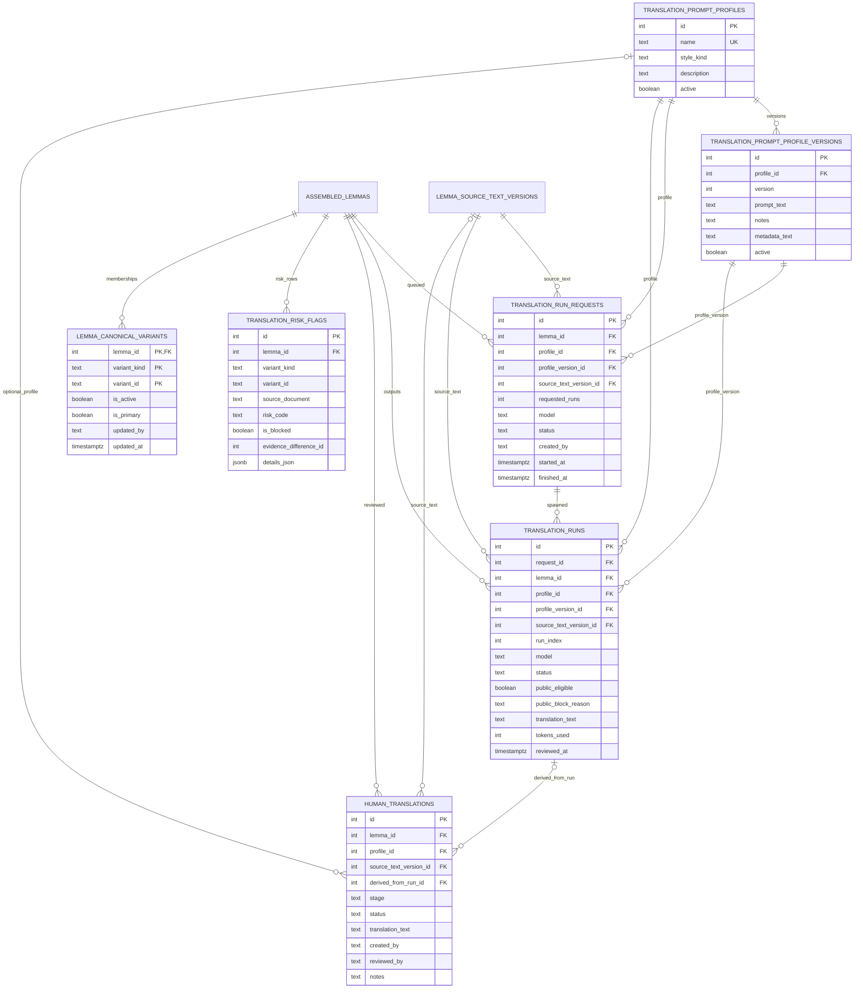
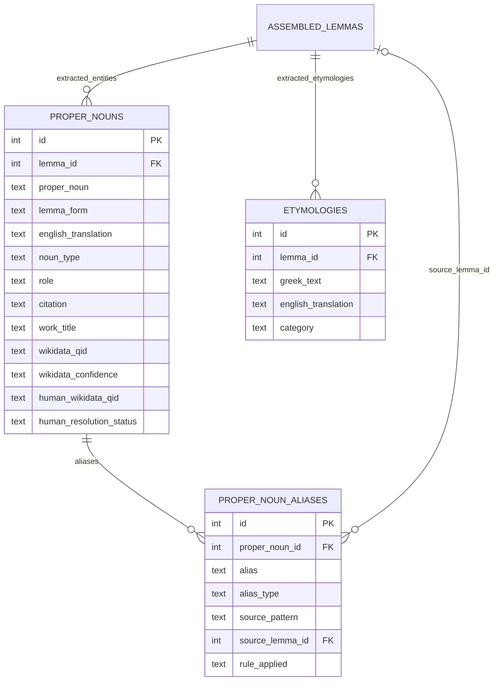
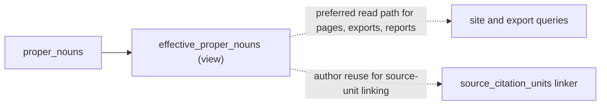
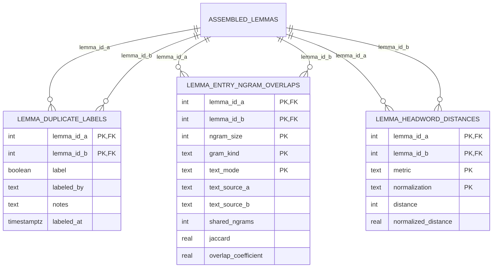
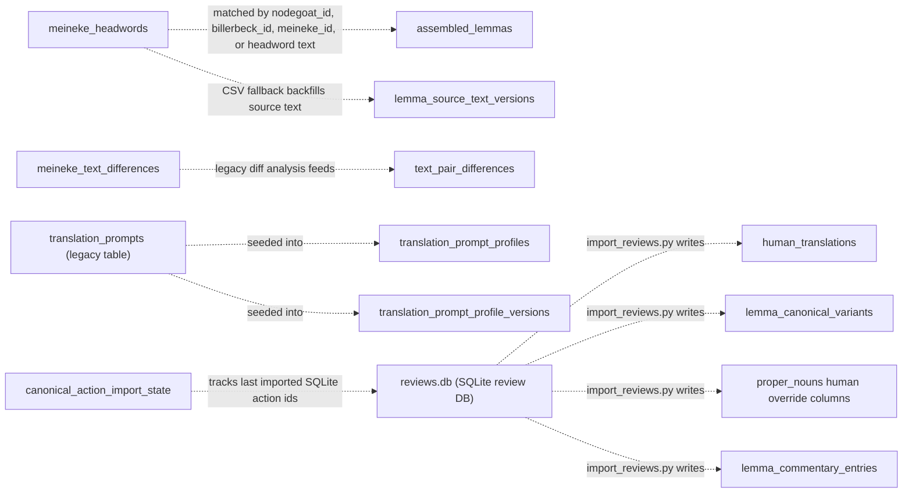

# Database ERD (PostgreSQL)

This document was rebuilt from scratch on 2026-03-09 from:

- live schema introspection on `raksasa` (`information_schema`, `pg_constraint`, `pg_indexes`)
- repo schema artifacts: `schema/base_schema.sql`, `stephanos_schema.sql`, and post-baseline migrations in `migrations/`
- code search across the repo for raw SQL reads/writes and runtime DDL fallbacks

Current status:

- `stephanos_schema.sql` matches the live `stephanos` database exactly under `check_db_schema.py --fail-on-extra`.
- The diagrams below reflect the current canonical schema, not the older historical shape.
- Where the code still relies on convention, fallbacks, or cross-database imports, those are called out explicitly as soft or transitional links.

## Ingestion + OCR + lemma assembly

## Source text versions + apparatus + commentary + citations + diffs

## Translation pipeline + human review + canonical/public selection

## Entity extraction + aliases + derived read model

## Similarity / duplicate-detection support tables

## Soft / transitional links from the codebase

These matter operationally even though they are not all enforced by foreign keys:

## Standalone / support objects not worth forcing into the main ERDs

- `translation_prompts`
  - Legacy prompt history table keyed by `version`.
  - Still present and still seeded from, but the active translation pipeline now runs through `translation_prompt_profiles` + `translation_prompt_profile_versions`.
  - `assembled_lemmas.translation_prompt_version` still points back to this legacy table only by convention; there is no foreign key.

- `canonical_action_import_state`
  - Tiny state table keyed by `source`.
  - Used only by `import_reviews.py` to remember high-water marks for append-only action imports from the separate SQLite review database.

- `meineke_headwords`
  - Imported reference CSV table with no hard foreign keys into the core graph.
  - Used for ID backfill, OCR-hole reporting, and source-text fallback when Meineke OCR is missing or incomplete.

## Notes on strange / unexpected parts

- `assembled_lemmas` is still a very wide table.
  - It mixes source text, OCR provenance, review state, legacy translation cache, nodegoat sync metadata, geodata, and analytics flags.
  - Even after newer normalized tables were added, many operational scripts still read or refresh its flattened fields.

- Deprecated JSON/text payloads still matter.
  - `images.lemma_json`, `assembled_lemmas.translation_json`, and `assembled_lemmas.source_image_ids` still have real read/write paths in the current codebase.
  - `images.translation_json` and `assembled_lemmas.assembled_json` have now been retired in the canonical schema by `20260309_drop_phase1_legacy_json_columns.sql`.
  - `source_image_ids` is marked deprecated in schema comments, but `assemble_lemmas.py` still uses it for upserts and uniqueness, with `lemma_images` acting as the normalized mirror rather than a complete replacement.

- Canonical/public selection is now membership-based, not pointer-table-based.
  - `lemma_publication_targets` is gone.
  - The current public-selection model is `lemma_canonical_variants` plus resolution logic in `canonical_variants.py` / `canonical_translation_service.py`.
  - Only one active primary row per lemma is enforced by a partial unique index, but a lemma can keep multiple active non-primary variants.

- `variant_kind` + `variant_id` is intentionally polymorphic.
  - In both `lemma_canonical_variants` and `translation_risk_flags`, those fields can refer to `translation_runs`, `human_translations`, or the legacy assembled translation lane.
  - That makes full referential integrity impossible at the database level.

- Risk gating still straddles old and new translation models.
  - `translation_runs` and `human_translations` are the normalized translation artifacts.
  - `translation_risk_flags` is still primarily driven from the legacy assembled translation lane, with `translation_run_utils.py` mirroring those blocks onto newer run rows.
  - `translation_risk_flags.evidence_difference_id` points to `meineke_text_differences.id` only by code convention; there is no FK.

- There are now two diff layers.
  - `meineke_text_differences` is the older, one-row-per-lemma analysis table.
  - `text_pair_differences` is the newer normalized table keyed by source-text version pairs.
  - The pipeline currently keeps both, with `sync_text_pair_differences.py` translating legacy analysis into the newer pair-based layer.

- Structured citation extraction coexists with the older flat source model.
  - `proper_nouns(role='source')` still stores author/work/citation data in the older flat format.
  - `source_citation_units` + `lemma_source_citation_mentions` stores the newer "author + work + book + identifiers" structure.
  - `generate_sources_page.py` explicitly falls back to `proper_nouns(role='source')` when the newer tables are absent or empty.

- `effective_proper_nouns` is now the real read model for named-entity work.
  - It is a view, not a table.
  - It folds human overrides over machine links, hides rows marked `human_resolution_status = 'removed'`, and exposes `effective_*` columns that most site/export code now reads instead of raw `proper_nouns`.

- The review workflow still spans two databases.
  - The web review app persists authoritative review actions in SQLite (`reviews.db`) on `merah`.
  - `import_reviews.py` then projects those actions into PostgreSQL tables such as `human_translations`, `lemma_canonical_variants`, `proper_nouns` human-resolution columns, and `lemma_commentary_entries`.
  - `canonical_action_import_state` exists only to track that import boundary.

- Runtime schema self-healing still exists in the codebase.
  - Multiple scripts still contain `CREATE TABLE IF NOT EXISTS`, `ALTER TABLE ... ADD COLUMN IF NOT EXISTS`, or `CREATE INDEX IF NOT EXISTS`.
  - The most important edge case is `sync_text_pair_differences.py`, which deliberately falls back to creating `text_pair_differences` without FKs under restricted DB roles.
  - That behavior is now compatibility code; schema drift should still be treated as drift and repaired into the canonical shape.

- Legacy uniqueness assumptions are still a little fragile.
  - `assembled_lemmas` still has a unique constraint on `(source_image_ids, entry_number, version)`.
  - Because `entry_number` can be `NULL`, PostgreSQL can still admit duplicate rows in the null-entry-number cohort; this is one reason the old duplicate-cleanup notes still matter.

## Concrete cleanup roadmap

Principles for the next round of schema work:

- Do not add new JSON columns for LLM output.
- Prefer typed columns plus child tables over opaque payload blobs.
- Make one structure authoritative before removing its legacy mirror.
- Drop read fallbacks before dropping columns, so failures are obvious in code review rather than in production data.

### Remaining structured blobs worth cleaning up

Counts below are from the live `raksasa` database on 2026-03-09.

| Object | Non-null rows | Current role | Cleanup difficulty |
| --- | ---: | --- | --- |
| `assembled_lemmas.translation_json` | 835 | legacy fallback for translation readers | low-medium |
| `source_citation_units.identifiers_json` | 57 | list of citation identifiers | medium |
| `translation_risk_flags.details_json` | 1035 | structured rule evidence for one current risk rule | medium |
| `assembled_lemmas.source_image_ids` | 3575 | legacy provenance array and current dedupe key | medium-high |
| `images.lemma_json` | 1708 | primary OCR payload store for two different OCR schemas | high |
| `meineke_text_differences.llm_result_json` | 598 | legacy detailed diff payload | high |
| `text_pair_differences.llm_result_json` | 2495 | current detailed diff payload | high |

Phase 1 completed in `20260309_drop_phase1_legacy_json_columns.sql`:

- dropped `images.translation_json`
- stopped writing `assembled_lemmas.assembled_json` in `assemble_lemmas.py` and dropped the column

The next active cleanup is therefore Phase 2.

### Phase 2: Finish the old `translation_json` -> `translation` migration

Target: `assembled_lemmas.translation_json`

Current readers to remove first:

- `generate_reference_site.py`
- `export_for_review.py`
- `generate_protected_pages.py`
- `sync_translation_risk_flags.py`
- `generate_translation_risk_report.py`
- `canonical_variants.py`
- `backfill_legacy_translation_runs.py`
- `generate_pipeline_progress.py`

Plan:

1. Backfill any remaining rows where `translation_json` is present but `translation` is empty.
2. Remove all fallback SQL and `json.loads()` logic that reads `translation_json`.
3. Update `assemble_lemmas.py` so Greek-text changes clear only the normalized translation fields, not the legacy JSON cache.
4. Add a migration to drop `assembled_lemmas.translation_json`.

Exit criteria:

- zero rows where `translation_json IS NOT NULL` and `COALESCE(translation, '') = ''`
- zero runtime references outside historical docs/scripts
- reference site and review export still render identical translations

### Phase 3: Replace `source_image_ids` with a real normalized provenance key

Target: `assembled_lemmas.source_image_ids`

This is the first cleanup item that needs real design, because the JSON array is not just legacy storage; it is also the current upsert key in `assemble_lemmas.py`.

Recommended replacement:

1. Keep `lemma_images` as the authoritative image membership table.
2. Add a deterministic `assembly_key` (or `source_signature`) column on `assembled_lemmas`.
   - Compute it from sorted image ids + `entry_number` + `version`.
   - Store the hash in a normal text column and put the uniqueness constraint on that hash, not on a JSON blob.
3. Update `assemble_lemmas.py` to upsert on `assembly_key`.
4. Remove remaining JSON-array readers:
   - `generate_reference_site.py`
   - `quarantine_lemmas.py`
   - `check_mismatches.py`
   - migration helper scripts that still compare against `source_image_ids`
5. Once `lemma_images` + `assembly_key` are authoritative, drop `source_image_ids`.

Why this order:

- It preserves dedupe behavior without keeping the provenance set itself in a JSON/text field.
- It avoids trying to infer uniqueness from `lemma_images` joins alone during writes.

### Phase 4: Split OCR storage by workflow instead of overloading `images.lemma_json`

Target: `images.lemma_json`

This is the biggest schema cleanup that directly matches your preference to store parsed LLM output as tables.

The hard part is that `images.lemma_json` currently holds two incompatible payload shapes:

- Billerbeck page OCR: page status + list of lemma entries
- Meineke page OCR: page status + `main_text_lines` + `apparatus_entries`

Recommended replacement:

1. Add page-level columns on `images`:
   - `ocr_status`
   - `ocr_notes`
2. Add a new Billerbeck OCR child table, for example `image_ocr_entries`:
   - `image_id`
   - `entry_order`
   - `entry_number`
   - `lemma`
   - `entry_type`
   - `greek_text`
   - `confidence`
   - `version`
3. For Meineke OCR, stop storing the intermediate page payload as JSON and write directly into the already-normalized source-text tables:
   - `lemma_source_text_versions`
   - `lemma_source_lines`
   - `lemma_apparatus_entries`
4. Transition readers one by one:
   - Billerbeck side: `assemble_lemmas.py`, `generate_protected_pages.py`, `sanity_check_lemmas.py`, `check_expected_range.py`
   - Meineke side: `assemble_meineke_texts.py`
5. After both lanes no longer read the JSON blob, drop `images.lemma_json`.

Important design note:

- Do not replace `images.lemma_json` with another generic JSON column.
- The right split is page metadata on `images`, structured OCR entries for Billerbeck, and direct normalized source-text rows for Meineke.

### Phase 5: Normalize citation identifiers

Target: `source_citation_units.identifiers_json`

This is a good medium-sized cleanup because the payload shape is simple and the row count is low.

Recommended replacement table:

- `source_citation_unit_identifiers`
  - `unit_id` FK
  - `ordinal`
  - `identifier_text`
  - optional later: `identifier_kind`

Code to update:

- `extract_source_citation_units.py`
- `link_wikidata_source_citation_units.py`
- `generate_sources_page.py`

Then drop `identifiers_json`.

### Phase 6: Replace `translation_risk_flags.details_json` with typed evidence columns

Target: `translation_risk_flags.details_json`

At the moment there is only one live risk rule in the table: `billerbeck_likely_translation_change`.
That makes this easier than it looks.

Recommended replacement columns:

- `billerbeck_id`
- `normalized_class`
- `translation_impact`
- `translation_impact_note`
- `summary`
- `synced_at`

Code to update:

- `sync_translation_risk_flags.py`
- `translation_run_utils.py`
- `canonical_variants.py`
- `export_for_review.py`
- `generate_translation_risk_report.py`

If new risk rules appear later, add rule-specific evidence columns or rule-specific child tables, not another catch-all JSON blob.

### Phase 7: Normalize diff evidence in the pair-based layer, then retire the legacy layer

Targets:

- `text_pair_differences.llm_result_json`
- `meineke_text_differences.llm_result_json`
- `meineke_text_differences.mechanical_patterns`
- `meineke_text_differences.word_pairs`

Recommended order:

1. Make `text_pair_differences` the only canonical diff table.
2. Add child tables there first:
   - `text_pair_difference_patterns`
   - `text_pair_difference_word_pairs`
3. Move report/page consumers to the pair-based tables.
4. Only after that decide whether `meineke_text_differences` should be:
   - dropped entirely, or
   - retained as a compatibility view / cache for legacy pages

Why not normalize both tables in parallel:

- The data model is already duplicated.
- Normalizing both layers before choosing a single canonical one doubles the work and the migration risk.

### Recommended implementation order

If we want the best ratio of payoff to risk after Phase 1, this is the order I would use:

1. `assembled_lemmas.translation_json`
2. `source_citation_units.identifiers_json`
3. `translation_risk_flags.details_json`
4. `assembled_lemmas.source_image_ids`
5. `images.lemma_json`
6. pair-based diff normalization, then retirement of `meineke_text_differences`

That sequence removes the easy dead weight first, then clears the low-risk legacy fallbacks, then tackles the two architectural jobs: OCR normalization and dedupe/provenance normalization.
