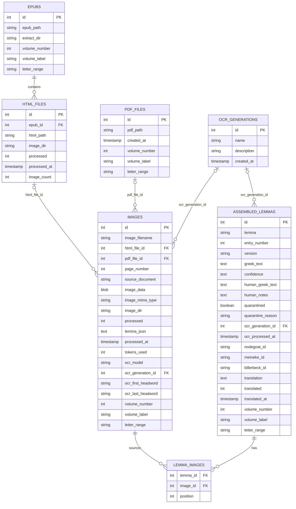
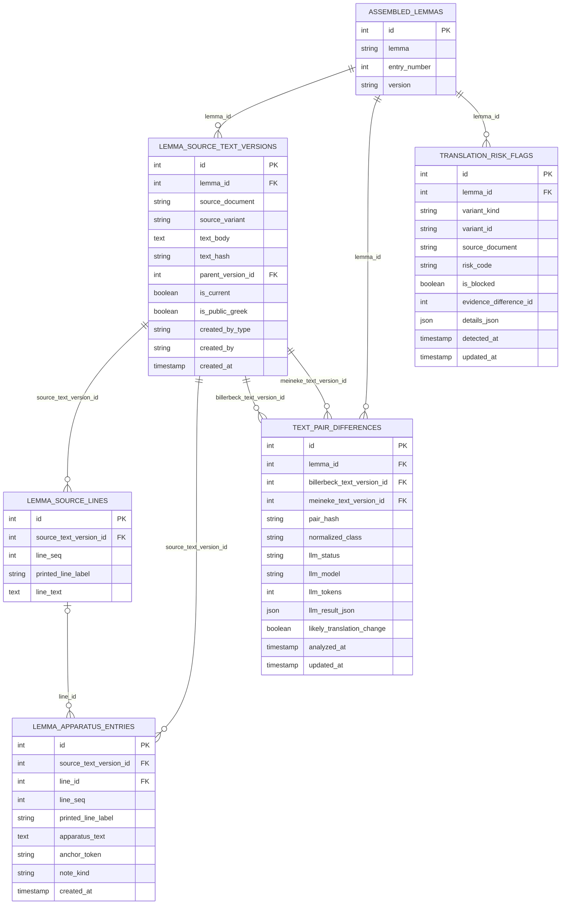
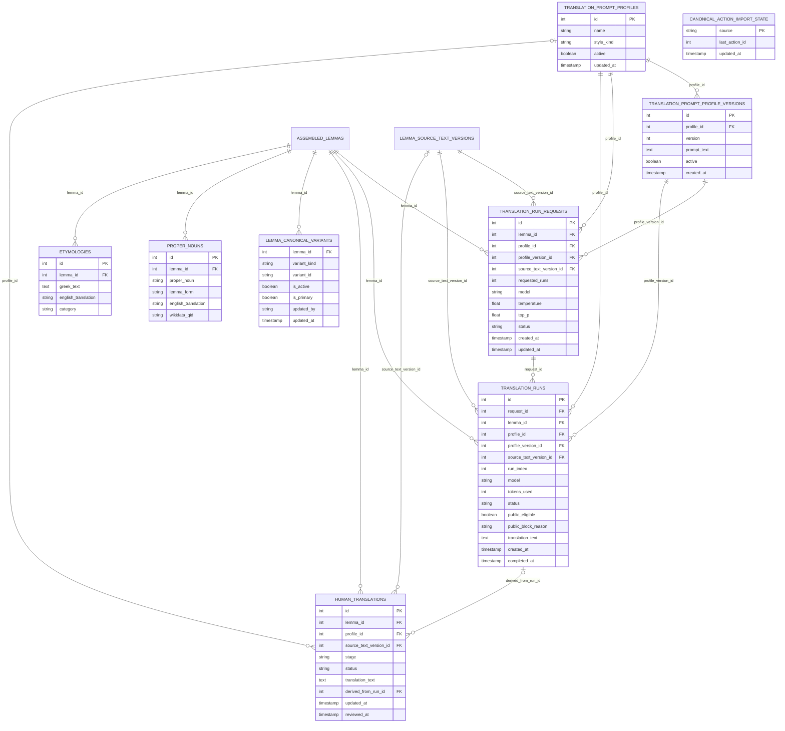

# Database ERD (PostgreSQL)

This project’s PostgreSQL schema is now tracked via a canonical bootstrap schema (`schema/base_schema.sql`) plus post-baseline incremental migrations (`migrations/`). Some pipeline scripts still “self-heal” by running `CREATE TABLE IF NOT EXISTS ...` / `ALTER TABLE ... ADD COLUMN IF NOT EXISTS ...`, but schema drift is intended to be caught by the schema preflight gate (see `SCHEMA_BASELINE.md`).

The relationships below are accurate for the canonical schema; older DBs (or restricted-role runs) may have missing constraints until repaired.

## Ingestion + OCR → images → assembled lemmas

## Source text versioning + diffs

## AI translations + human translations + “canonical/public” selection

## Notes on “strange/unexpected” parts

- **No single authoritative schema (historically)**: this project accumulated DDL in both migrations and runtime “ensure_*” helpers. As of the 2026-02-27 baseline reset, the intended canonical schema is captured in `schema/base_schema.sql` + the checked-in `stephanos_schema.sql` snapshot (see `SCHEMA_BASELINE.md`).
- **Soft / missing FKs (historical + edge cases)**:
  - Some scripts intentionally create tables *without* foreign keys (e.g., `sync_text_pair_differences.py`) so they can run under restricted DB roles. That behavior is a compatibility fallback.
  - The canonical schema snapshot enforces FKs for core provenance and pipeline joins (including `images.html_file_id → html_files.id`, `images.pdf_file_id → pdf_files.id`, `images.ocr_generation_id → ocr_generations.id`, `assembled_lemmas.ocr_generation_id → ocr_generations.id`, and `lemma_images.* → (assembled_lemmas, images)`). If a live DB is missing these constraints (e.g., because a restricted-role script created a table early), treat it as drift and repair via a migration so the preflight gate can enforce it.
- **Polymorphic references by design**: `variant_kind` + `variant_id` (TEXT) in `translation_risk_flags` and `lemma_canonical_variants` can point at *different* tables (`translation_runs`, `human_translations`, or legacy assembled columns). That makes referential integrity unenforceable at the DB level.
- **Canonical/public consolidation**:
  - Historically, `lemma_publication_targets` acted as a *single pointer* for public translation selection.
  - As of the post-baseline migration `migrations/20260227_drop_lemma_publication_targets.sql`, the canonical schema uses **only** `lemma_canonical_variants` (set membership + optional “primary”) for public/canonical selection.
- **`images` is a convergence point for multiple ingestion styles** (EPUB HTML vs rendered PDF pages), so the “where is the actual image?” story is split across `image_data` (BLOB) and `image_dir`+`image_filename` (filesystem).
- **Legacy denormalized columns still matter operationally**:
  - `assembled_lemmas.source_image_ids` (JSON/TEXT) is deprecated in favor of `lemma_images`, but it historically drove uniqueness and deduplication.
  - Because PostgreSQL UNIQUE indexes treat `NULL` as distinct, a NULL `entry_number` can allow accidental duplicates when the uniqueness strategy included `entry_number` (see `/Users/gregb/Documents/devel/stephanos/DATABASE_ISSUES.md`).
- **Mixed boolean conventions**: older flags like `processed`/`translated` are typically stored as `INTEGER 0/1`, while newer tables tend to use `BOOLEAN`.
- **Wide “god table”**: `assembled_lemmas` is simultaneously (a) source text container, (b) review state, (c) external IDs, (d) geocoding, and (e) analysis flags. That’s pragmatic, but it’s “unexpected” if you expect clean normalization.
