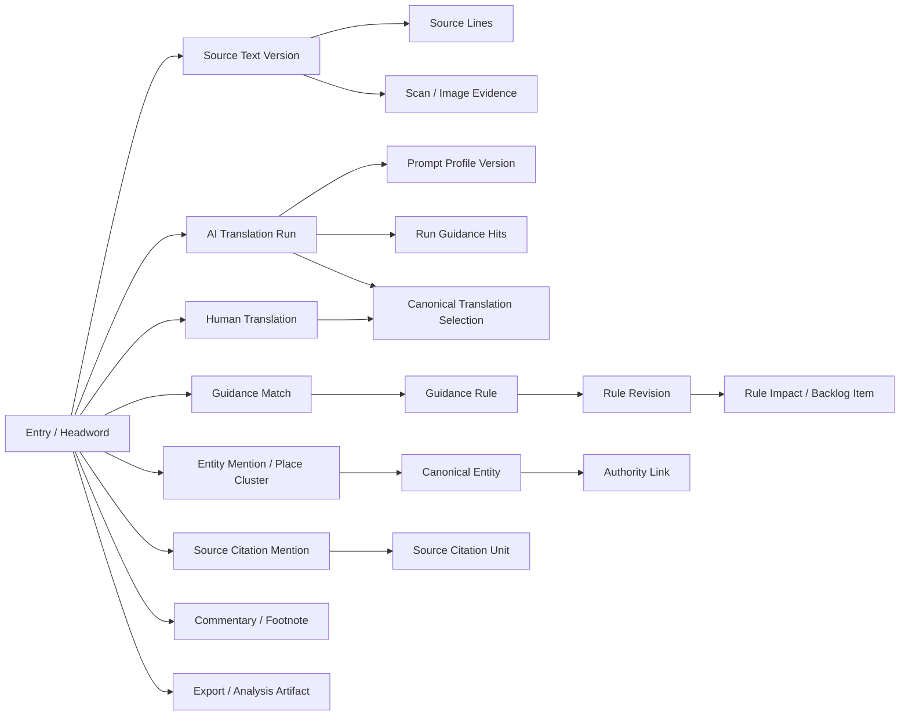

# Stephanos Content Model Sketch

Date: 2026-05-15

Status: design-planning sketch. This is not an implementation patch.

Related artifacts:

- `SITE_DESIGN_DISCOVERY_AND_WORK_PLAN.md`
- `SITE_PAGE_INVENTORY_AND_OWNERSHIP.md`
- `SITE_USER_TASK_INVENTORY_FROM_TRANSCRIPTS.md`

## Scope Decision

This covers item 6 from the design work plan: the content model sketch. Per the 2026-05-15 direction, this does not do lightweight user interviews or comparator review. The model below is derived from the existing Stephanos tasks, generated pages, review tools, and schema.

The current database schema is treated as evidence, not as the product model the UI must expose. In particular, the UI should not teach users the accidental distinctions between generator outputs, protected reports, old review fields, new variant tables, and temporary entity-import tables.

Hard public/private rule: Billerbeck source text, Billerbeck OCR, and Billerbeck scan imagery are protected-only. Public pages may refer to Billerbeck-era translation/provenance issues only in abstract methodological terms, without exposing the source text, OCR text, scan images, or direct public links to those materials.

## Model In One Sentence

Stephanos is an entry-centred scholarly reference system: each entry/headword gathers source text versions, translations, entities, source citations, commentary, guidance hits, review actions, and operational provenance; public and protected workspaces are different projections of those same objects.

## Core Content Objects

| Object | Current data anchors | Public role | Protected/editorial role | Design note |
| --- | --- | --- | --- | --- |
| Entry / headword | `assembled_lemmas` | Main public object page and browse/search unit | Main review object and batch unit | The entry is the anchor object. Other data should feel attached to it, not scattered across pages. |
| Source text version | `lemma_source_text_versions`, `lemma_source_lines` | Shows the current public Greek source and source provenance; never Billerbeck source text | Lets reviewers compare Meineke, Keesling, Billerbeck, OCR, and manual variants | Source version must be explicit anywhere translation quality is judged. Billerbeck variants are protected-only. |
| Source evidence | `images`, `lemma_images`, `pdf_files`, `html_files`, protected scan pages | Usually a contextual evidence link for public-safe sources only | Diagnostic/evidence view for source lookup, OCR, and scan mismatch checks | Scans are evidence, not a public top-level section. Billerbeck scans/OCR are never public. |
| AI translation run | `translation_runs`, `translation_run_requests` | May appear only when public-eligible and clearly labelled | Main comparison object for review, variants, prompt evaluation, and provenance | Never show "latest" without a stable run identity and source-text version. |
| Human translation | `human_translations`, legacy review fields | Source of reviewed/final public translation | Initial, reviewed, and final human review states | Human text should be protected from automatic overwrites. |
| Canonical translation selection | `lemma_canonical_variants`, `public_cgi/canonical_translation.cgi` | Determines what the public entry should foreground | Lets reviewers promote a variant to official/canonical status | Canonical means selected, not merely newest. |
| Review action | `reviews.db`, `review_cgi/save.go`, review history fields | Usually not public, except aggregate status | Records who changed, approved, blocked, or finalized a translation | Review history should be visible in protected workspaces and summarized carefully in public. |
| Guidance rule | `translation_guidance_rules`, `translation_guidance_rule_revisions` | Method/provenance object where public-safe | Editable rule object for Gabriel/Greg | A rule has kind, lifecycle, status, application mode, and revision history. |
| Guidance match | `translation_guidance_matches`, `translation_run_guidance_matches` | Optional provenance attached to an entry | Explains which rules fired or failed for an entry/source version | Match evidence is important for trust but should be compact. |
| Guidance impact / task | `translation_guidance_backlog_items`, scan queue/status tables | Not public by default | To-do list for old translations affected by newer rules | This is a workflow object, not just a report row. |
| Entity mention | `proper_nouns`, `place_clusters`, `brady_entity_tags` | Linked names, places, peoples, works, and source references | Candidate/correction object for Brady and Greg | The UI should hide the current split between table types where possible. |
| Canonical entity | `effective_proper_nouns`, `effective_place_clusters`, authority fields | Public linked object page, map point, or reference node | Entity-centred correction target with all contexts | This may need to become a real product object even if it is currently a projection. |
| Authority link | Wikidata, ToposText, Pleiades, Manto, RE fields | External link and confidence/provenance cue | Candidate, approved, corrected, not-found, or not-alignable decision | Raw IDs need human labels and failure states. |
| Source citation | `source_citation_units`, `lemma_source_citation_mentions` | Author/work/passage object and entry cross-link | Extraction/review/export target | Treat authors and works as public reference objects, not just strings in entries. |
| Commentary / footnote | `lemma_commentary_entries`, `lemma_footnote_detection_runs` | Layered explanatory notes where reviewed | AI-generated or human-edited notes requiring approval | Commentary should attach to phrase/passage anchors, not just to the whole entry. |
| Analysis report | `generate_statistics_site.py`, derived analysis tables | Curated research reports | Research diagnostics and paper evidence | Reports should be organized by question, not by chart filename. |
| Pipeline artifact | `openai_batch_jobs`, `openai_batch_items`, progress/pipeline pages | Mostly hidden from public reading | Operations dashboard, freshness, failures, ETA | Operational state should not crowd scholarly browsing. |
| Export package | CSV/PDF/TEX/article packets/nodegoat exports | Public or collaborator deliverables | On-demand review/research outputs | Exports need dates, scope, source version, and public/private status. |

## Relationship Sketch



## Entry Content Anatomy

Every entry page or entry workbench should be assembled from the same conceptual modules.

| Module | Content | Current anchors | Public projection | Protected projection |
| --- | --- | --- | --- | --- |
| Identity | Headword, normalized headword, entry number, letter, volume, source IDs | `assembled_lemmas` | Stable title and citation metadata | Batch selector, sort keys, old/new IDs |
| Source text | Current public Greek, alternate source versions, line breaks | `lemma_source_text_versions`, `lemma_source_lines` | Current public Greek, with source label | Source-version selector and comparison |
| Source evidence | Scans, OCR evidence, source page links | `lemma_images`, `images`, protected scan pages | Contextual evidence link if public-safe | Full scan/OCR/debug evidence |
| Translation | Canonical translation, AI variants, human variants | `translation_runs`, `human_translations`, legacy translation fields | Canonical translation and simple status | Full variant list, promote/select controls |
| Review state | Not reviewed, reviewed, final, blocked, stale, source issue | review DB, `human_translations`, `lemma_canonical_variants` | Conservative public status label | Detailed workflow state and action history |
| Entities | Places, people, deities, ethnics, works, aliases | `proper_nouns`, `place_clusters`, `brady_entity_tags` | Reviewed links, map points, object pages | Candidate review, correction, authority fields |
| Source citations | Authors, works, passages, identifiers | `source_citation_units`, `lemma_source_citation_mentions` | Linked sources/works and citations | Extraction status and correction queue |
| Commentary | Phrase-level notes, footnotes, explanation | `lemma_commentary_entries` | Reviewed public commentary layer | Draft AI notes, human edits, stale notes |
| Guidance | Rules relevant to this entry, formula hits, impacts | `translation_guidance_matches`, `translation_guidance_backlog_items` | Collapsed method/provenance if useful | Match evidence, rule impacts, rerun/review tasks |
| Provenance | Prompt profile/version, source text version, run ID, timestamps | `translation_prompt_profiles`, `translation_prompt_profile_versions`, run tables | Compact provenance disclosure | Full audit trail |
| Exports | PDF/CSV/review-packet inclusion | export scripts | Download/cite actions | Review packet and research-output controls |

## Conceptual Object Shapes

These are UI/content-model shapes, not proposed table definitions.

### Entry

```text
Entry
  id
  headword
  normalized_headword
  entry_number
  letter
  volume / source IDs
  public_status_summary
  source_text_versions[]
  canonical_source_text_version
  translation_variants[]
  canonical_translation
  entity_mentions[]
  source_citations[]
  commentary_entries[]
  guidance_matches[]
  review_tasks[]
  evidence_links[]
  export_links[]
```

### Translation Variant

```text
TranslationVariant
  variant_kind: ai_run | human_translation | legacy_assembled
  variant_id
  text
  source_text_version_id
  stage: initial | reviewed | final
  status: draft | completed | approved | rejected | hidden | blocked | outdated
  prompt_profile_version_id
  guidance_revision_set
  created_by / reviewed_by
  created_at / reviewed_at
  public_eligible
  canonical_state: none | active | primary
```

### Entity

```text
Entity
  entity_id
  display_label
  entity_type
  place_type / region
  authority_links[]
  confidence
  resolution_status
  contexts[]
  human_decision
  public_visibility
```

Important: the current implementation has `proper_nouns`, `place_clusters`, and `brady_entity_tags`. The product model should present a unified entity/authority workflow even if the implementation still uses multiple tables.

### Authority Link

```text
AuthorityLink
  authority_type: wikidata | topostext | pleiades | manto | re | other
  authority_id
  label
  description
  url
  confidence
  source: machine | human | Brady import | ToposText import
  status: candidate | approved | corrected | not_found | not_alignable | removed
```

### Guidance Rule

```text
GuidanceRule
  rule_key
  rule_code
  kind: gloss | formula | proper_noun | contextual_bias
  label
  preferred_translation
  semantic_domain
  lifecycle_stage: investigate | recognizer | guidance | inactive
  status: in_progress | settled | unsure | retired
  application_mode: replace | required | advisory
  revisions[]
  matches[]
  impacts[]
```

### Commentary Entry

```text
CommentaryEntry
  lemma_id
  source_text_version_id
  anchor_source: greek | translation | source_citation | entity
  anchor_range
  phrase_text
  commentary_text
  note_kind
  generation_source: human | ai_detected | ai_rerun | human_edited_ai
  review_status
  publication_status
  stale_state
```

## Public And Protected Projections

| Projection | Shows | Hides or collapses | Primary owner |
| --- | --- | --- | --- |
| Public entry page | Headword, current Greek, canonical translation, reviewed entities, source citations, public commentary, compact provenance | Draft variants, raw review actions, scan-debug data, unresolved entity candidates, Billerbeck source/OCR/scans, pipeline state | Public reader |
| Review entry workbench | Source-version selector, all translation variants, canonical-selection controls, review notes, guidance hits, impacts, entity links, source evidence | Public-reader visual simplicity | Greta / Gabriel |
| Final translation workspace | Many finished entries, source text and final translation, inline impacts, edit controls | Raw OCR and low-level pipeline data | Greta |
| Entity curation workspace | Entity candidates, authority links, all contexts, Brady/ToposText imports, correction state | Public presentation polish | Brady |
| Guidance workbench | Rule table, revisions, matches, scan status, impacts, backlog actions | Public-reader simplification | Gabriel / Greg |
| Analysis landing | Curated reports, chart groups, research questions, export links | Operational logs unless directly needed | Greg / paper authors |
| Operations dashboard | Pipeline state, generation freshness, queue failures, scan diagnostics, deploy/export status | Public scholarly navigation | Greg |

## State Labels The UI Should Teach

The product needs a small, shared state language. Raw database statuses can remain underneath, but visible labels should be consistent.

| Domain | Suggested visible states | Notes |
| --- | --- | --- |
| Entry review | Not reviewed, AI available, Human initial, Human reviewed, Final, Blocked, Source issue, Stale | Avoid exposing internal combinations unless the user asks for detail. |
| Translation variant | Draft, Completed AI, Approved AI, Human initial, Human reviewed, Final, Rejected, Hidden, Outdated | "Latest" should not be a status. It is a sort order. |
| Source text | Current public Greek, Alternate source, OCR source, Manual source, Source conflict, Scan mismatch | Keesling/Meineke/Billerbeck should be explicit where relevant in protected review. Billerbeck should not be a public source label attached to visible source text. |
| Entity | Candidate, Matched, Ambiguous, Not found, Human approved, Human corrected, Not alignable, Removed, Added | Entity chips should show labels/descriptions, not only IDs. |
| Authority link | Machine candidate, Human chosen, Imported from Brady, Imported from ToposText, External missing, External ambiguous | Supports Brady's workflow without leaking every provisional state publicly. |
| Guidance rule | Investigate, Recognizer, Active guidance, Settled, Unsure, Retired | Distinguish detect-only from translation-affecting rules. |
| Guidance impact | Pending, In progress, Completed, Dismissed, Cancelled, Failed | This is a to-do list, so resolved items should disappear from default open views. |
| Commentary | AI draft, Human edited, Public reviewed, Private note, Stale | Public pages should show only reviewed public commentary. |
| Pipeline | Fresh, Running, Stale, Failed, Blocked | Operations-only unless there is a public reason to disclose it. |

## Page Model Implications

### Public Entry Page

Recommended module order:

1. Entry header: headword, entry number, source/citation affordance, simple status.
2. Reading panel: current Greek and canonical English translation.
3. Entity strip: linked places, people/deities, ethnics, works, and source authors.
4. Map preview when there are mapped places.
5. Source citations and related source/work links.
6. Commentary layer, collapsed unless the reader opts in.
7. Provenance disclosure: source text, translation status, prompt/guidance method where public-safe.
8. Related entries/search results.

### Review Entry Workbench

Recommended module order:

1. Batch and navigation header: letter, position, status, previous/next, jump selector.
2. Source text area: current source version plus source-version switcher.
3. Translation comparison: canonical, latest AI run, selected AI run, human initial/reviewed/final.
4. Editing area: current human/final translation and notes.
5. Guidance hits and rule impacts.
6. Entity/source citation context.
7. Evidence links: scans, source differences, prompt/run provenance.
8. Save/promote/block actions.

### Entity Curation Workspace

Recommended module order:

1. Entity header: label, type, current authority state, confidence.
2. Context list: all entries and source snippets where the entity appears.
3. Authority candidates: Wikidata, ToposText, Pleiades, Manto, RE, imported Brady state.
4. Human correction form: type, place type, region, chosen authority, notes.
5. Disagreement queue: machine vs Brady/ToposText/current public state.
6. Public preview: how this entity would appear in the reader view.

### Guidance Workbench

Recommended module order:

1. Dense rule table with filters for kind, semantic domain, lifecycle, status, application mode.
2. Rule detail/revision panel.
3. Match evidence and sampled occurrences.
4. Scan controls and scan status.
5. Impact backlog: pending review/rerun/dismiss decisions.
6. Public methodology preview for rules that can be disclosed.

## URL And Navigation Sketch

Existing URLs should remain stable where possible. The content model suggests new section landing pages and clearer routes, even if the first implementation only changes generated navigation labels.

| Area | Existing examples | Conceptual route | Notes |
| --- | --- | --- | --- |
| Read home | `reference_site/index.html` | `/` or `/read/` | Public entry point: search, browse, map, sources, downloads. |
| Entry | `headword_2054.html` | `/entry/{id-or-slug}` | Preserve old static paths; route naming can come later. |
| Letter browse | `letter_kappa.html` | `/letter/kappa` | Public browse, not review batch selector. |
| Review landing | `/cgi-bin/review.cgi` | `/review/` | Status-aware protected workspace. |
| Review entry | `/cgi-bin/review.cgi?id=...` | `/review/entry/{id}` | Same object as public entry, different projection. |
| Final review | `/cgi-bin/final_review.cgi` | `/review/final` | Corpus/batch-level finalization workspace. |
| Entities | `entities.html`, `/cgi-bin/entities.cgi` | `/entities/`, `/entities/{id}` | Public entity pages and protected curation should share object labels. |
| Guidance | `translation_guidance.html`, `/cgi-bin/guidance.cgi` | `/guidance/`, `/guidance/rules/{rule_key}` | Public method view and protected editing view should be distinct. |
| Analysis | `statistics.html` | `/analysis/` | Curated reports by research question. |
| Operations | `pipeline.html`, `progress.html`, protected reports | `/ops/` | Protected or clearly separated from public reading. |

## Content Rules

These rules should guide design and later implementation.

1. Human-reviewed translation wins over AI output unless a human explicitly changes the canonical selection.
2. A translation without source-text-version provenance is not review-grade.
3. "Latest AI translation" is a sort/filter, not a trustworthy label by itself.
4. Billerbeck source text, OCR, and scans are never public.
5. Public pages should foreground stable scholarly content and collapse operational provenance.
6. Protected workspaces should expose provenance, alternatives, stale states, and uncertainty directly.
7. Entity review should be organized around entities and authority decisions, with entries as contexts.
8. Guidance rules should show both human intent and machine evidence.
9. Source evidence is always reachable from review, but it should not dominate public navigation.
10. Exports should carry scope, date, source text version, translation status, and public/private status.
11. Old generated URLs can remain, but navigation should teach the conceptual model, not the generator model.

## Open Model Questions

These are product/data-model questions to resolve before a large UI refactor:

1. Should a canonical entity become a real table, or remain an effective projection over `proper_nouns`, `place_clusters`, and Brady imports?
2. Should an entry object sit above `assembled_lemmas` to unify source editions, duplicate labels, and future non-epitome variants?
3. Which entity resolution states are public-safe before human approval?
4. How should phrase-level commentary anchors survive translation edits and source-text-version changes?
5. Should article review packets remain exports, or become persistent review-batch objects?
6. How aggressively should legacy translation fields on `assembled_lemmas` be hidden behind the newer variant/canonical model?
7. Is Operations public transparency desirable, or should pipeline/progress pages become authenticated-only except for stable downloads?

## First Implementation Wedge

The smallest useful implementation path is not a database migration. It is a view-model pass:

1. Define a public `EntryView` shape in the generator layer using the modules above.
2. Define a protected `ReviewEntryView` shape that uses the same entry identity but includes variants, guidance, source evidence, and review actions.
3. Define an `EntitySummary` shape shared by public entry pages, entity pages, map pages, and entity curation.
4. Replace generator-specific page headers with section-aware shells: Read, Review, Entities, Guidance, Analysis, Operations.
5. Only then decide whether the underlying schema needs consolidation, especially around canonical entities and legacy translation fields.
