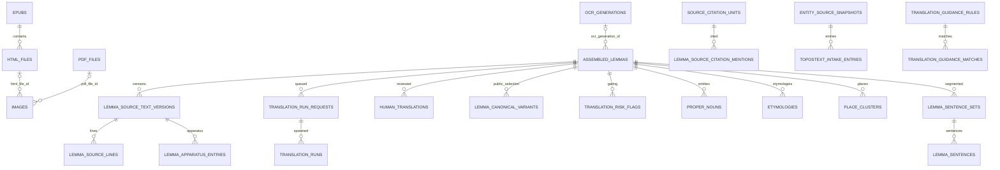

# Stephanos — Data Model

PostgreSQL database `stephanos`, **93 tables + 2 views** (`stephanos_schema.sql`,
8,669-line pg_dump snapshot; 49 post-baseline `migrations/`). Single access point
`db.py:get_connection()`; raw SQL, no ORM, **no triggers / materialized views**.
The review web app (`review_cgi/*.go`) is a separate Go service over **SQLite**
snapshots and never touches Postgres; `import_reviews.py` is the only bridge back.

## Hub: `assembled_lemmas`
One row per lemma-version; FK parent of ~40 tables. Very wide (60+ cols) mixing
OCR text, provenance, review state, nodegoat sync, geocoding, and analytics flags.
- PK `id`; UNIQUE `(source_image_ids, entry_number, version)`; partial UNIQUE
  `(billerbeck_id, version) WHERE billerbeck_id IS NOT NULL`.
- Text: `greek_text` (OCR, nullable), `human_greek_text`, `translation`,
  `corrected_english_translation`, `reviewed_english_translation`.
- `source_image_ids` is marked **DEPRECATED** but is still the dedupe/upsert key.
- The only DB-enforced FK on it is `ocr_generation_id → ocr_generations`.

## ER sketch

## Subsystems (93 tables)
- **Ingestion/OCR/provenance (8)**: `epubs`, `html_files`, `pdf_files`, `images`,
  `ocr_generations`, `lemma_images`, `billerbeck_german_pages`, `lemma_billerbeck_german_refs`.
- **Source text/apparatus/commentary (5)**: `lemma_source_text_versions`,
  `lemma_source_lines`, `lemma_apparatus_entries`, `lemma_commentary_entries`,
  `lemma_footnote_detection_runs`.
- **Diff layers (2, overlapping)**: `meineke_text_differences` (legacy) vs
  `text_pair_differences` (normalized).
- **Translation — normalized (7 + 1 legacy)**: `translation_prompt_profiles`,
  `_profile_versions`, `translation_run_requests`, `translation_runs`,
  `human_translations`, `lemma_canonical_variants`, `translation_risk_flags`,
  legacy `translation_prompts`.
- **Translation-guidance (9 + batch 2)**: `translation_guidance_rules`,
  `_rule_revisions`, `_matches`, `_freshness`, `_backlog_items`, `_scan_queue`,
  `_scan_batches`, `_action_import_map`, `translation_run_guidance_matches`,
  `openai_batch_jobs`, `openai_batch_items`.
- **Entities/aliases/citations (8)**: `proper_nouns`, `proper_noun_aliases`,
  `etymologies`, `source_citation_units`, `lemma_source_citation_mentions`,
  `source_citation_extraction_runs`, `source_quote_passages`, `oracle_references`.
- **Canonical authority + topostext intake (12)**, **Places (3)**,
  **Similarity/dedupe (3)**, **Sentence segmentation/grammar/MT metrics (16)**,
  **Vocabulary signatures (5)**, **Rarity/length analytics (4)**, **Meineke
  word-lemma indexing (2)**, **Review-import bookkeeping (3)**. Full inventory in
  `stephanos_schema.sql`; per-subsystem line refs in git history of this doc.

## Writers/readers matrix (core tables)
Producer = INSERT/UPDATE/DELETE; Consumer = SELECT.

| Table | Writers | Readers |
| --- | --- | --- |
| `assembled_lemmas` | `assemble_lemmas` (INS/DEL), ~20 UPD (`translate_lemmas`, `import_reviews`, `sync_nodegoat`, `link_wikidata_places`, `quarantine_lemmas`, `extract_*`…) | ~90 (`generate_*`, `analyze_*`, `export_*`, enqueue/backfill) |
| `images` | `extract_*`, `enqueue_meineke_holes`; UPD `batch_process`, `process_*` | `assemble_*`, `generate_reference_site`, `generate_protected_pages` |
| `lemma_source_text_versions` | `assemble_meineke_texts`, `backfill_source_text_versions` | ~45 |
| `translation_run_requests` | `enqueue_*`, `import_claude_translation_workspaces`, `backfill_legacy_translation_runs` | `translate_lemmas`, `generate_translation_operations_page` |
| `translation_runs` | `translate_lemmas`, `import_claude_translation_workspaces`, `backfill_legacy_translation_runs` | ~20 (`canonical_variants`, `generate_*`, `sync_nodegoat`, `export_for_review`) |
| `human_translations` | `import_reviews`, `canonical_translation_service` | ~22 |
| `lemma_canonical_variants` | `import_reviews`, `canonical_translation_service` | site gen, `sync_nodegoat`, `export_for_review` |
| `proper_nouns` | `extract_proper_nouns`, `link_wikidata`, `import_reviews` | ~15 (via view `effective_proper_nouns`) |
| `translation_guidance_backlog_items` | **NONE** | `export_for_review`, `generate_translation_guidance_page` (see ANOMALIES D-01) |

Consumer class is overwhelmingly `generate_*` (static-site/PDF) + `export_*`.
