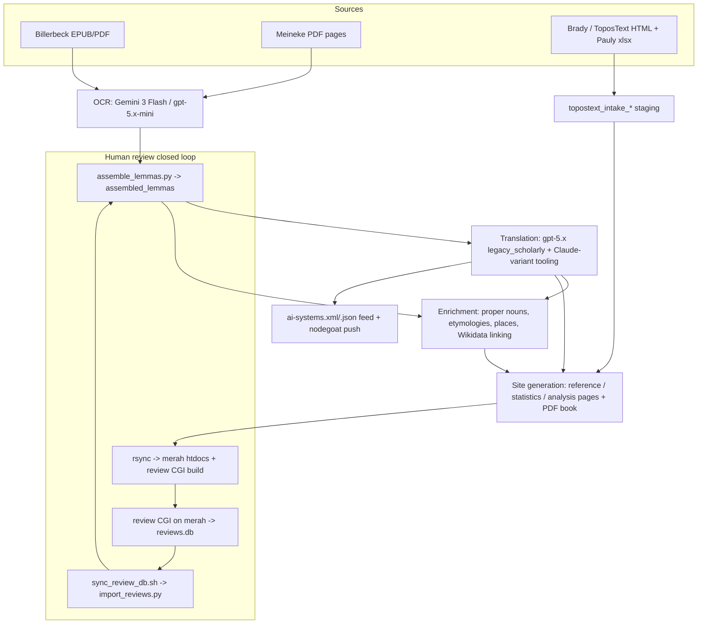

# Stephanos — Architecture Overview

Stephanos extracts, translates, enriches, and publishes a structured dataset of
Stephanus of Byzantium's *Ethnika* (from Billerbeck's edition, Meineke, and
Brady Kiesling / ToposText material). It is a batch pipeline over a single
PostgreSQL database (`stephanos`) that regenerates a static site and several
CGI-backed review tools deployed to `stephanos.symmachus.org` on the OpenBSD
host **merah**. The pipeline itself runs from a checkout on the mac and/or
`stephanos@raksasa` (schema preflight and a `pg_dump` fallback SSH there).

These docs are a synthesis of a four-part read of the codebase (job graph, data
model, ingestion/transformation, publish/deploy). Where a claim was checked
against the live host, the verification is recorded in `ANOMALIES.md`.

## Data flow

The **review closed loop** is the one cycle in the graph: the daily run exports
a read-only snapshot (`review_data.sqlite`) to merah; reviewers edit through the
Go review CGI, which writes `reviews.db` on merah; the next run pulls `reviews.db`
back (`sync_review_db.sh`) and imports the human corrections
(`import_reviews.py`). `review_data.sqlite` (outbound snapshot) and `reviews.db`
(inbound edits) are distinct databases.

## Components at a glance

| Layer | Doc | Key artifacts |
| --- | --- | --- |
| Orchestration / job graph | `JOBS.md` | `run_daily_pipeline.sh`, `run_topostext_pipeline.sh`, `setup_cron.sh` (legacy) |
| Data model | `DATA_MODEL.md` | PostgreSQL `stephanos`, 93 tables + 2 views, hub `assembled_lemmas` |
| Ingestion & transformation | `INGESTION.md` | extraction, OCR, translation, Wikidata linking |
| Publish / deploy | `DEPLOY.md` | site generators, rsync to merah, review CGI, `ai-systems` feed, nodegoat |
| Consolidated bug list | `ANOMALIES.md` | severity-ranked, de-duplicated, with live-verification status |

## Two hard operational facts

- The daily pipeline **pulls the default branch** at the start of each run (Step 0),
  so anything merged to `main` runs the next night. Do work on branches and let a
  human merge.
- Step 0 **skips `git pull` whenever the working tree is dirty** — so uncommitted
  changes silently freeze self-update. See `ANOMALIES.md` P-05.
